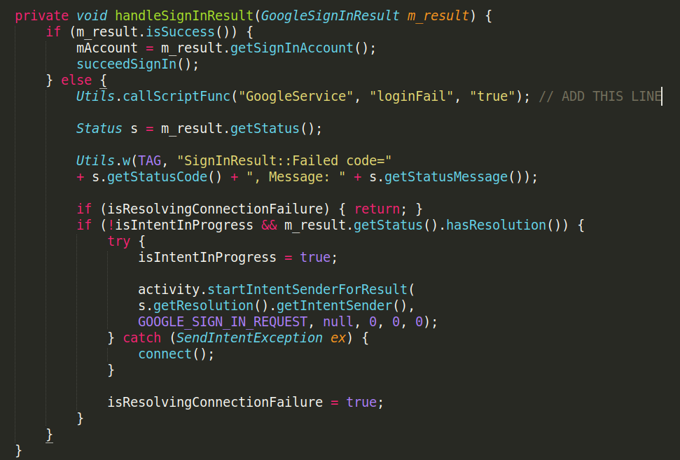

# :musical_note: Clef Clicker

## Description
Clicker game demo for Android (built from Godot Engine).

## [:video_game: App demo](https://play.google.com/apps/testing/com.melonsoda.godotgpgstest)
[](https://play.google.com/store/apps/details?id=com.melonsoda.godotgpgstest)

## Features
 - Google Play Games Services integration
 - Architectures -> armv7, arm64v8, x86
 - Particles
 - BGM & SFX
 - Trails (Line2D)

## Dependencies
 - [Godot 3.1-stable (manual build)](https://github.com/godotengine/godot/tree/3.1.1-stable)
 - FrogSquare's modules:
   - [GodotGoogleService](https://github.com/FrogSquare/GodotGoogleService)
   - [GodotSQL](https://github.com/FrogSquare/GodotSQL)

## Instructions
 1. Clone Godot 3.1.1-stable.
 2. **DO NOT FORGET TO CHECKOUT TO BRANCH 3.1.1-stable!**
 3. Clone FrogSquare's modules and follow those instructions (add repos to "modules" directory etc).
 4. Customize FrogSquare's module by adding this line to *GODOT_ROOT/modules/GodotGoogleService/android/PlayService.java*:  
   
 ```java
 Utils.callScriptFunc("GoogleService", "loginFail", "true"); // ADD THIS LINE
 ```
 5. Compile Godot for your development platform: [Windows](https://docs.godotengine.org/en/3.1/development/compiling/compiling_for_windows.html), [Linux](https://docs.godotengine.org/en/3.1/development/compiling/compiling_for_x11.html).
 6. Create and configure an App at [Google Play Console](https://play.google.com/apps/publish).
 7. Link your game to a *Google Play Games Services* instance with achievements and leaderboards.
 8. Edit Achievements at [Achievements.gd](project/scripts/singleton/Achievements.gd).
 9. Edit Achievements at [Leaderboards.gd](project/scripts/singleton/Leaderboards.gd).
 10. Link your app to [Firebase console](https://console.firebase.google.com) and download *google-services.json*. Put it into *GODOT_ROOT/platform/android/java*.
 11. Compile the [Android templates](https://docs.godotengine.org/en/3.1/development/compiling/compiling_for_android.html), passing your App ID to FrogSquare's GodotGoogleService module.  
   ``` sh
   scons p=android target=release_debug android_arch=armv7
   scons p=android target=release android_arch=armv7
   scons p=android target=release android_arch=arm64v8
   scons p=android target=release android_arch=x86
   cd platform/android/java
   ./gradlew build
   ```
 12. Run the project and set the android templates.
 13. Set certificate keys and export a release apk.
 14. Upload it to [Google Play Console](https://play.google.com/apps/publish).

## Permissions
 - Access Network State
 - Internet